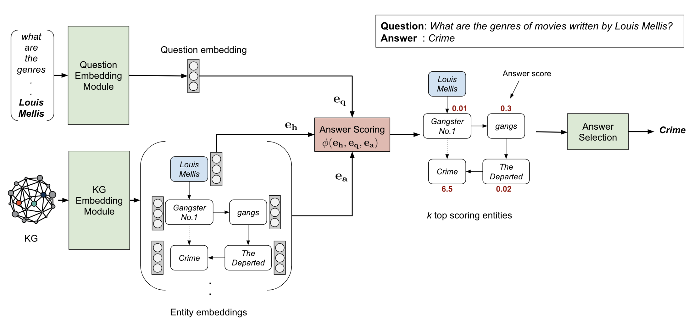

# 基于知识图谱嵌入和文本嵌入的知识图谱问答系统

## 背景与选题介绍

本课题主要考虑知识图谱上的问答 (Question Answering on Knowledge Graphs, KGQA) 问题，即给定背景知识图谱和问题-答案训练集，需要训练模型来回答新提出的问题。

知识图谱是 NLP 和数据挖掘等领域中的数据的一种重要的表现形式，它以有向图的形式表示多个实体之间的联系。一个知识图谱可以表示成一个由若干三元组所构成的集合，其中每个三元组形如 $(h,r,t)$ ，表示存在一个由头实体 $h$ 到尾实体 $t$ 的关系 $r$ 。知识图谱中每个实体和每个关系都有一个自然语言的串与之对应，它们具有语义信息。通常记知识图谱中的所有实体构成的集合为 $\mathcal{E}$ ，所有关系构成的集合为 $\mathcal{R}$ 。

KGQA 问题考虑的是基于给定的一个背景知识图谱，通过推理来回答一些相关的问题。这需要在理解以自然语言形式给出的问题的基础上，通过在背景知识图谱上进行推理来完成，下图给出了一个例子。


可以看到，KGQA 问题面临着许多困难：首先需要“理解”给出的问题和知识图谱上的实体、关系，这是与 NLP 高度相关的人物；其次，实际中能得到的知识图谱很可能有部分连接缺失（例如上面的例子中 `Gangster No. 1` 和 `Crime` 之间缺少直接的 `has_genre` 关系），这使得在知识图谱上进行推理更加困难。另外，大多数解决 KGQA 问题的已有方法通过探索知识图谱中的路径来进行推理，并且需要限定探索的路径长度，这会引入一个超参数，而且会导致无法得到超出设定的路径长度的答案。

## 数据集介绍与预处理

本课题使用数据集 WebQuestionsSP 。该数据集包括 4737 个能够通过知识图谱 Freebase 中的一跳和两跳信息回答的问题和回答。由于原本的 Freebase 很大，这里参考了论文，只采用其一部分子集。具体来说，只在 Freebase 中保留 WebQuestionsSP 中涉及到的实体的两跳邻居和涉及到的关系，这样得到的 KG 包含约 1800000 个实体，500 个关系和 5700000 个三元组。为了加大问题难度、体现模型效果，这里使用的数据集在此基础上随机去除了 $50\%$ 的关系，这使得知识图谱更加不完整。该数据集可直接从网上下载得到。

WebQuestionsSP 可从官网下载，但形式较为复杂且包含很多本任务中不需要的信息，需要进一步处理以从 `json` 文件中提取、整合出有用的信息。使用用 `Python` 语言编写的 `DataProcessing.py` 文件对上述 `json` 进行处理，得到的数据集 `qa_train_webqsp.txt` 、`qa_test_webqsp.txt` 形如：

```
what is the name of justin bieber brother [m.06w2sn5]	m.0gxnnwq
what character did natalie portman play in star wars [m.09l3p]	m.0drf_
what country is the grand bahama island in [m.03st9j]	m.0160w
what kind of money to take to bahamas [m.0160w]	m.01l6dm
what character did john noble play in lord of the rings [m.02fgm7]	m.0gp7f
```

 ## EmbedKGQA 模型介绍

本项目中我参考了论文 "Improving Multi-hop Question Answering over Knowledge Graphs using Knowledge Base Embeddings" 中提出的 EmbedKGQA 模型。模型框架图如下：



形式化地说，EmbedKGQA 接收一个自然语言问题 $q$ 和该问题的一个话题实体 $e_h$ 作为输入，输出是一个实体 $e_t$ 作为答案。

EmbedKGQA 主要由三个模块组成：KG Embedding Module、Question Embedding Module 和 Answer Selection Module 。下面分别进行介绍。

### KG Embedding Module

KG Embedding 是一个已被深入研究的课题，它的一般目标是将 $\mathcal{E}$ 中的每个实体及 $\mathcal{R}$ 中的每个关系分别嵌入为一个高维向量，同时设计一个评分函数 $\phi:\mathcal{E}\times\mathcal{R}\times\mathcal{E}\to\mathbb{R}$ ，使得当 $(h,r,t)\in\mathcal{T}$ 时 $\phi(h,r,t)>0$ ，当 $(h,r,t)\notin\mathcal{T}$ 时 $\phi(h,r,t)<0$ ，这里 $\mathcal{T}$ 表示知识图谱中包含的三元组集合。$\phi(h,r,t)$ 一般被设置为关于 $h,r,t$ 的嵌入向量的函数。

EmbedKGQA 使用了已有的一种 KG Embedding 的方法，即 ComplEx Embedding ，该方法考虑将每个 $e\in\mathcal{E},r\in\mathcal{R}$ 分别嵌入为高维复数向量 $e_e,e_r\in\mathbb{C}^{d}$ ，并定义评分函数为：

$$
\phi(h,r,t)=\text{Re}\left(\sum_{k=1}^{d}e_h^{(k)}e_r^{(k)}\bar{e_t}^{(k)}\right),
$$

其中，$\text{Re}$ 表示取一个复数的实部。后面的实验中取了 $d=200$ 。

本模块的训练方法这里略去。

EmbedKGQA 中使用 ComplEx Embeddings 得到每个实体的 Embedding 用于后续的训练，而关系的 Embedding 则被忽略。

### Question Embedding Module

本模块将输入的自然语言问题 $q$ 也嵌入到 $\mathbb{C}^{d}$ 空间中，生成复数向量 $e_q\in\mathbb{C}^{d}$  。具体做法是，使用 RoBERTa 模型先将 $q$ 嵌入为一个 $768$ 维向量，再将其通过 $1$ 个可学习的线性全连接层得到 $\mathbb{C}^d$ 中的一个向量（实际为 $\mathbb{R}^{d}$ 中的一个向量）。

EmbedKGQA 的训练目标是对于问题 $q$ 、话题实体 $h$ 、和对应的答案实体集合 $\mathcal{A}\subseteq\mathcal{E}$ ，使得下面的式子成立：
$$
\phi(e_h,e_q,e_a)>0,\forall a\in\mathcal{A},\\
\phi(e_h,e_q,e_{\bar{a}})<0,\forall\bar{a}\notin\mathcal{A}.
$$
其中，使用 KL-散度损失函数进行训练（对 $\phi$ 函数的结果先取 $\text{Softmax}$ ），并且对真实标签进行标签平滑。RoBERTa 模型支持通过 fine-tune 来达成这个训练目标。

### Answer Selection Module

该模块简单地取所有实体中使得评分函数值最大的实体作为答案：

$$
\DeclareMathOperator{\argmax}{arg max}
e_{\text{ans}}=\argmax\limits_{a\in\mathcal{E}}\phi(e_h,e_q,e_a).
$$

## 具体实现与实验结果

具体实现采用 `Python` 语言，使用 `PyTorch` 工具，并参考了论文作者上传至 `github` 的代码，且使用 GPU 加速计算。实现中，还使用了标签平滑、提前停止等方法来防止过拟合。

原代码中使用 `kge` 库进行 KG Embedding Module 的训练，这里省去了这个训练过程，直接使用了作者提供下载的训练好的 ComplEx Embedding 。提交的代码主要关注该模型后面的训练步骤。

我仔细阅读并理解了 `github` 上的代码，并对其进行了大幅度的精简。我成功进行了复现工作，经过约 $10$ 小时的训练，最终得到的模型在测试集上的准确率为 $48.2\%$ ，略高于论文中报告的 $47.4\%$ 。这里的准确率指标是 hit@$1$ 。

## 一些其它发现和思考

在对数据集进行预处理时发现，从官网上下载的 WebQuestionsSP 数据集经过处理后得到的结果与论文作者在 `github` 上上传的经过同样处理的数据集并不完全相同，实际测试时使用了我处理得到的数据集。这可能是复现结果高于论文结果的原因。

论文中介绍的 Question Embedding Module 与实际代码有所不同，论文中称问题 $q$ 经过 RoBERTa 后通过了 $4$ 个 $\text{ReLU}$ 激活的线性全连接层，但实际上由于 RoBERTa 本身经过 fine-tune ，这是没有很大必要的，而且我经过实验发现按论文上的说法实现效果非常差（训练很快就提前停止了，准确率不到 $1\%$ ），我还尝试了改用 $\text{Sigmoid}$ 激活函数，效果依旧很差（准确率约为 $7\%$ ）。另外，论文中说使用的损失函数为二值交叉熵，但实际代码中使用的是 KL 散度。

原代码中还尝试对 ComplEx Embedding 得到的嵌入增加 Dropout 层来提升效果，但由于这些嵌入实际上在训练完 KG Embedding Module 后就已经固定，这些 Dropout 层实际上是没有必要的。不过，作者使用的最佳超参数中已经将这些层的 Dropout 概率设置为 $0$ 。

## 参考文献

Saxena, Apoorv, Aditay Tripathi, and Partha Talukdar. "Improving multi-hop question answering over knowledge graphs using knowledge base embeddings." *Proceedings of the 58th Annual Meeting of the Association for Computational Linguistics*. 2020.

Trouillon, Théo, et al. "Complex embeddings for simple link prediction." *International conference on machine learning*. PMLR, 2016.

Liu, Yinhan, et al. "Roberta: A robustly optimized bert pretraining approach." *arXiv preprint arXiv:1907.11692* (2019).

